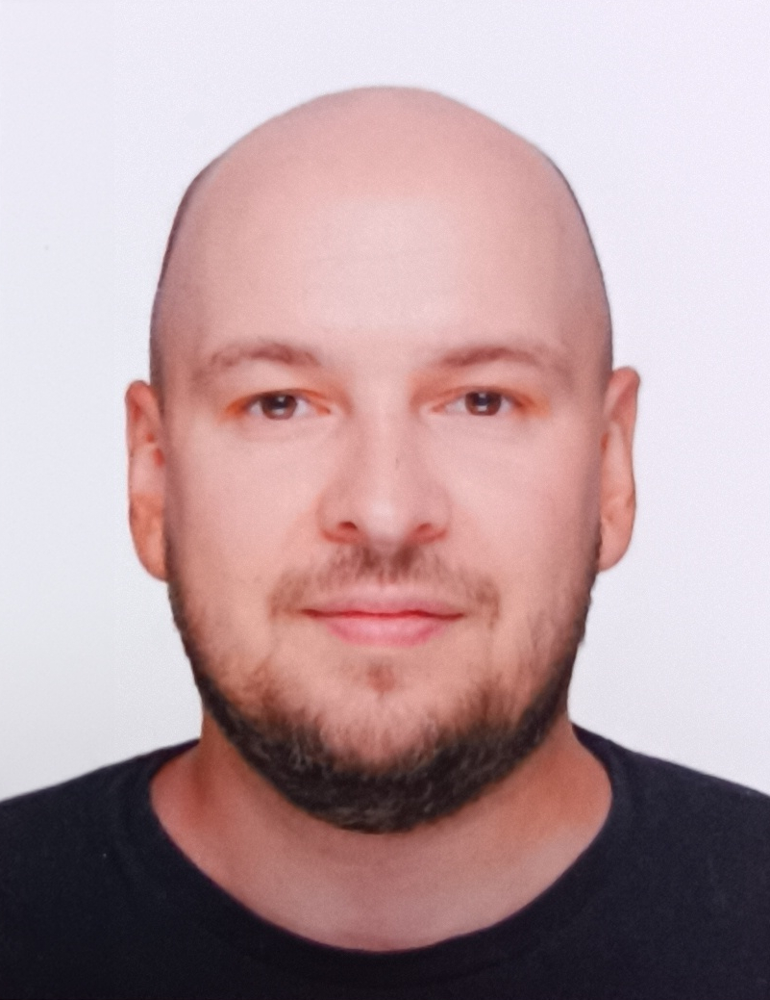

# Curriculum Vitae

**Name:** Dmitry  
**Surname:** Lesnyak



**Phone:** +7 (924) 214-63-53  
**E-mail:** [dimm4eg@gmail.com](mailto:dimm4eg@gmail.com)  
**Discord RS:** ldm1try

## Interests

I really want to do front-end and work in a good company with competent employees, so that I can do my favorite thing together, solving interesting problems. For several years now I have been partially engaged in front-end. Mastered some layout techniques and a little Javascript.

## Skills

JS, PHP, HTML5, CSS3, Git, Laravel Framework.

## Code examples

```
document.addEventListener('DOMContentLoaded', () => {
  let app = document.querySelector('#app')
})

console.log(app)

app.style.background = "#ededed"
app.style.padding = "5px"
```

## My projects

- [Procrastination](https://github.com/ldm1try/procrastination.git)

## Experience

Developed websites on Bitrix CMS for city administrations.

## Education

Far Eastern University of Railways, specialty: Engineer of Railways.

Рекомендации к составлению CV:
оформление CV на ваше усмотрение. Старайтесь выполнить работу максимально качественно. При выборе дизайна CV можно руководствоваться примерами, приведёнными в материалах к заданию
CV составляется на английском языке.
при составлении CV рекомендуется указывать реальные данные
в CV добавьте своё фото или аватарку. Фото предпочтительнее
в CV укажите актуальные контакты для связи, в т.ч никнейм на дискорд-сервере rs school
в качестве примера кода приведите решение задачи с сайта Codewars.
Если решённых задач пока нет, подойдёт задача, которую нужно решить при регистрации на Codewars
код добавляется при помощи символов и тегов, а не картинкой
для выполненных проектов добавьте название проекта, ссылку на код проекта на гитхабе или ссылку на страницу проекта.
Если выполненных проектов пока нет, в качестве первого проекта укажите само CV
